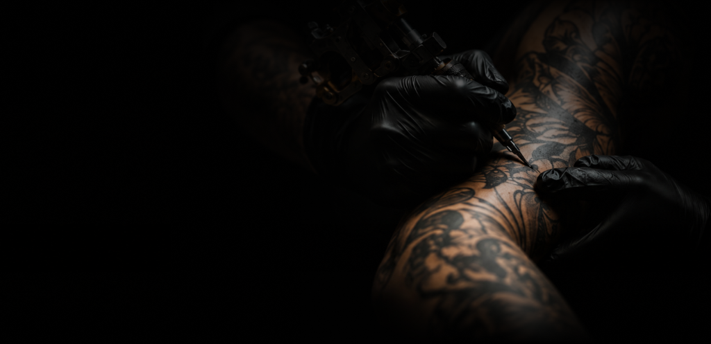

# ⚡ BLACK TATTOO STUDIO ⚡

A modern, high-contrast, premium web application for **Black Tattoo Studio** featuring bespoke tattoo consultation booking, artist portfolios, services overview, client reviews, and direct dynamic WhatsApp appointment routing.



---

## 🔥 Key Features

- **⚡ Dynamic WhatsApp Appointment Routing**:
  - **Mr. Dhinesh (Founder & Artist)**: WhatsApp booking request sent directly to `+91 8973747449`.
  - **Mr. Vijay (Founder & Artist)**: WhatsApp booking request sent directly to `+91 6382073503`.
- **📅 Interactive Booking Form**:
  - Full client information (Name, Phone, Email).
  - Date picker (formatted to `DD/MM/YYYY`) and time slot selection.
  - Multi-service checkbox selection with live selection counters.
  - Custom concept & placement description area.
  - Automated WhatsApp message formatting with shop branding.
- **🎨 Founders & Artists Spotlight**:
  - Featuring **Mr. Dhinesh** (7+ Years Exp) and **Mr. Vijay** (8+ Years Exp).
  - Certified Professionals & Tattoo Experts feature badges.
  - Direct WhatsApp micro-interaction links.
- **💉 Comprehensive Services Showcase**:
  - Custom Tattooing, Hyper-realistic Portrait Artwork, Fine Line Linework, Full Sleeves, Precision Piercing, and Permanent Cosmetic Makeup.
- **⭐ Split-Divide Testimonial Reviews**:
  - Dynamic scroll-triggered horizontal split and merge animation for authentic client feedback.
- **💎 Dark Glassmorphic Design System**:
  - Electric Cyan accents (`#00c8f0` / `#069cc1`), high-contrast dark backgrounds (`#050a12`), subtle background glows, and smooth scroll transitions.

---

## 🛠️ Technology Stack

- **Frontend Framework**: [React 18](https://react.dev/)
- **Build Tool / Bundler**: [Vite](https://vitejs.dev/)
- **Styling**: [Tailwind CSS](https://tailwindcss.com/)
- **Iconography**: [Lucide React](https://lucide.dev/)
- **Version Control**: Git & GitHub

---

## 🚀 Getting Started

Follow these steps to run the project locally on your machine:

### Prerequisites
Make sure you have [Node.js](https://nodejs.org/) (v16 or higher) installed.

### Installation

1. **Clone the repository**:
   ```bash
   git clone https://github.com/balasadhana/black-tattoos-studio.git
   ```

2. **Navigate to the project directory**:
   ```bash
   cd black-tattoos-studio
   ```

3. **Install dependencies**:
   ```bash
   npm install
   ```

4. **Start the development server**:
   ```bash
   npm run dev
   ```
   Open your browser and navigate to `http://localhost:5173`.

5. **Build for Production**:
   ```bash
   npm run build
   ```

---

## 📞 Studio Contact & Support

- **Studio Location**: Black Tattoo Studio
- **Artists**:
  - **Mr. Dhinesh**: [+91 8973747449](https://wa.me/918973747449)
  - **Mr. Vijay**: [+91 6382073503](https://wa.me/916382073503)

---

### 📄 License
This project is proprietary and maintained by Black Tattoo Studio.
